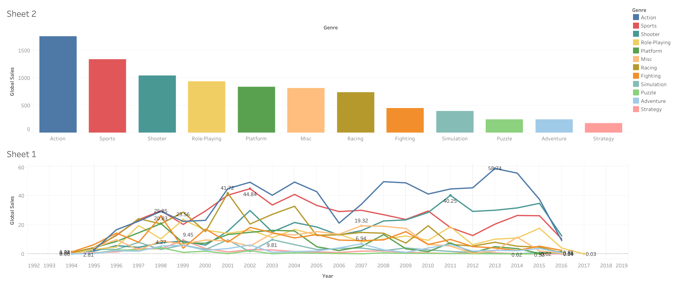

# Tableau-Dashboards
[Tableau Public Profile](https://public.tableau.com/app/profile/shariq.shahab4270)

# Dashboard 1: Covid Dashboard
Link To the Dashboard: https://public.tableau.com/app/profile/shariq.shahab4270/viz/CovidDashboard_16837539502870/Dashboard1
Description: This dashboard provides a comprehensive view of the Covid-19 pandemic, including the latest global and regional data on confirmed cases, deaths, and recoveries. Use this dashboard to track the spread of the virus over time, identify hotspots, and monitor public health measures to slow its spread.

# Dashboard 2: World Happiness
Link To the Dashboard: https://public.tableau.com/app/profile/shariq.shahab4270/viz/WorldHappiness_16723301622890/WorldHappiness
This dashboard analyzes global happiness data from the World Happiness Report, including factors such as GDP per capita, social support, and life expectancy. Use this dashboard to compare happiness scores across countries, identify factors that contribute to happiness, and track changes in happiness over time.

# Dashboard 3 : Global CO2 Emissions Dashboard
Link To the Dashboard: https://public.tableau.com/app/profile/shariq.shahab4270/viz/GlobalCO2Emissions_16727615582290/Sheet1
This dashboard provides an overview of global carbon dioxide emissions from various sources. Use this dashboard to analyze trends in emissions over time, identify the largest emitters by sector and country, and track progress towards global emissions reduction targets.

# Dashboard 4 : Games Popularity Dashboard
Link To the Dashboard: https://public.tableau.com/app/profile/shariq.shahab4270/viz/Games_16725881970130/Dashboard1
This dashboard analyzes trends in the video game industry, including sales and their popularity. Use this dashboard to identify popular game genres and track game sales over time.

